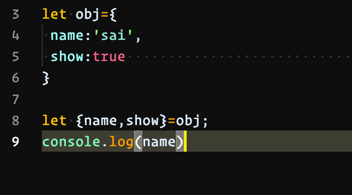
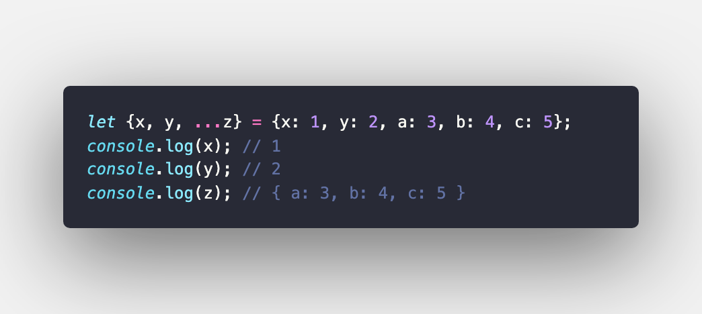

# "SIMPLE"-Presentation of Object
####    1-About Object
####    2-About Object Methods
####    3-Destructuring and spread ("Деструктуризатсия ва паҳншавӣ")
####    4-this

# _____LETS DO IT TOGETHER_____
# Object
#### JavaScript object is a nonprimitive data-type that  allows you to store multiple collections of data

# Tj-Object
#### Объекти JavaScript як навъи маълумоти ибтидоӣ мебошад, ки имкон медиҳад шумо барои захира кардани якчанд маҷмӯаҳои маълумот

## Object Method
### Entries
 The Object.entries() method returns an array of a given object's own enumerable string-keyed property [key, value] pairs.

## Keys
The Object.keys() method returns an array of a given object's own enumerable property names, iterated in the same order that a normal loop would.

## Values
The Object.values() method returns an array of a given 
object's own enumerable property values

# -_____Destructuring and spread_____ –
## Destructuring
#### The destructuring assignment syntax is a JavaScript expression that makes it possible to unpack properties from object, into distinct variables.

## Spread
#### The spread operator ... is used to  expand or spread an to make it works with own enumerable properties of an object. 
### For example
 
#### You can use the spread operator to clone the own enumerable properties of an object.
#### for example:

## "THIS" DAR JS"
#### The behavior of the this keyword in JavaScript is somewhat different from its comparison with religious languages. There are also differences in collection in strict and non strict mode.
## Must Now
#### 1-this is not a variable. It is a keyword.  You cannot change the value of this.
#### 2-In JavaScript, the this keyword refers to an object
#### 3-Which object depends on how this is being invoked (used or called).
## _Where this is called_
#### 1 In an object method, this refers to the object.
#### 2 Alone, this refers to the global object.
#### 3 In a function, this refers to the global object.
#### 4 In an event, this refers to the element that received the event
#### 5 Methods like call(), apply(), and bind() can refer this to any object.
## This Precudere
#### To determine which object this refers to; Use the following precedence of order.
PRECUDENE | OBJECT
   ++++ 1 ++++    | Bind()
  ++++ 2 ++++    | Apply() and call()
  ++++ 3 ++++ | Object Method
  ++++ 4 ++++ | Global scope
  
  # THANK  YOU  FOR WATCHING THIS
